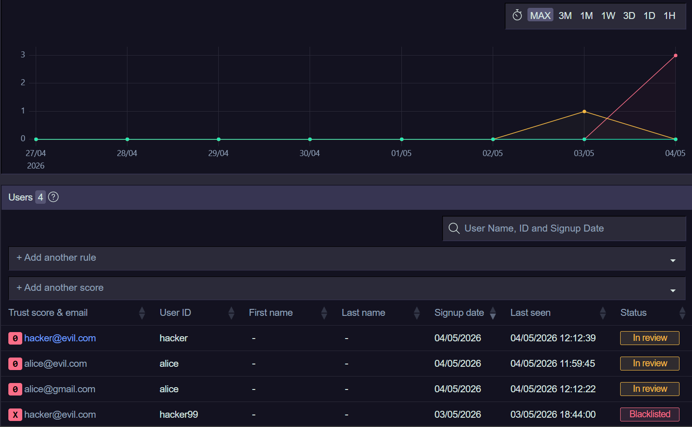
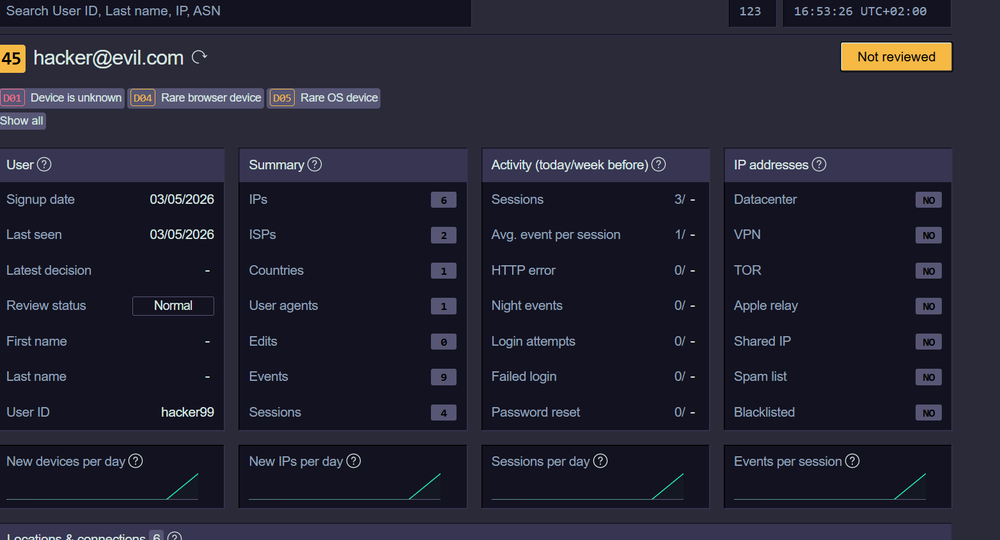
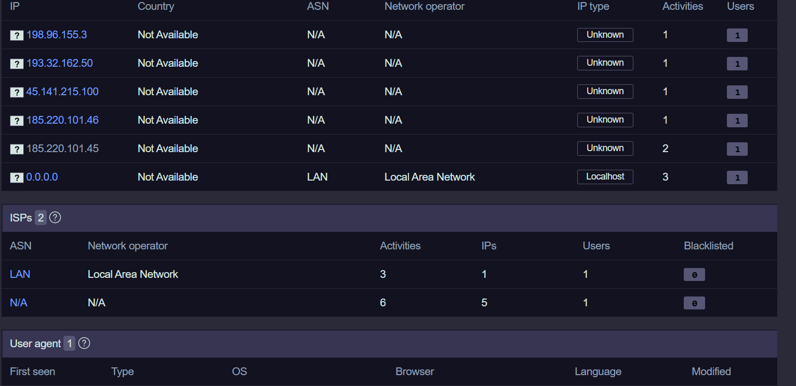
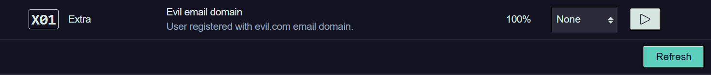

# Tirreno Security Lab

A hands-on cybersecurity project demonstrating real-time threat detection, risk scoring, and automated blacklisting using the [tirreno](https://tirreno.com) open-source security framework.

## What I Built

- Deployed tirreno security framework using Docker
- Built a Flask web app with login simulation
- Integrated tirreno API for real-time event tracking
- Simulated cybersecurity attacks and watched tirreno detect them
- Built custom detection rules using tirreno's rules engine

## Attacks Simulated

- **Account Takeover** — multiple logins from different IPs
- **Brute Force** — repeated failed login attempts
- **Suspicious email detection** — custom rule flagging evil.com domains

## Tech Stack

- Python / Flask
- Docker
- PHP (tirreno rules engine)
- PostgreSQL
- REST APIs

## How to Run

### 1. Start tirreno
curl -sL tirreno.com/t.yml | docker compose -f - up -d

### 2. Run the Flask app
python app.py

### 3. Open the login page
http://localhost:5000

### 4. Open the tirreno dashboard
http://localhost:8585
### screenshots 
### Users Dashboard

### Users List

### IP addresses

### Custom Rules

## What I Learned

- How real security frameworks detect threats
- REST API integration for security event tracking
- Docker container management
- Custom rule development for threat detection
- SOC analyst workflow — reviewing, blacklisting, investigating users
